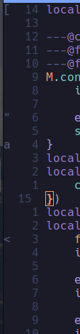

# melon.nvim

An unobtrusive way to view marks in the sign column

## Installation

With lazy, you can install this plugin with:

```lua
{
    "CWood-sdf/melon.nvim",
    opts = {},
}
```

## Configuration

Melon comes with the following default configuration:

```lua
{
    --- Which marks to ignore
    ignore = function(_)
        return false
    end,
    --- The options to pass to :sign define
    --- I personally have the field texthl set to "Comment" so that the marks aren't super obtrusive
    signOpts = {},
}
```



## Usage

Melon automatically attaches to several events so that the signs are nearly always up to date.
